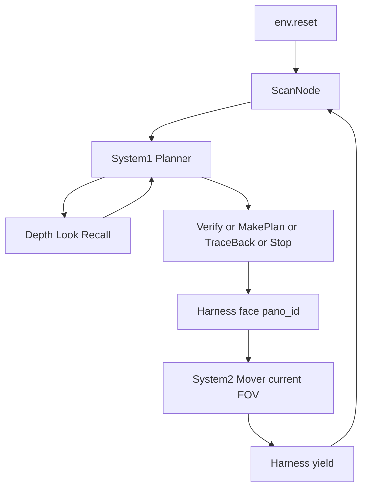

# HarnessNav M3 工程设计

Habitat HM3D ObjectNav。复用 [nav/occupancy.py](nav/occupancy.py)、[test/pix2move/run_pix2move.py](test/pix2move/run_pix2move.py)、[perception/base.py](perception/base.py)。**路径规划只用 navmesh greedy follower**，不重建 A\*，不训练 NavTG，不接 ORB/RTAB 等视觉 SLAM。

约定：JSON 一律 snake_case；`pano_id ∈ {0,2,4,6,8,10}`；`xyz=[x,y,z]` 米；`uv=[u,v]`；`yaw`/`world_yaw` 弧度。图不进 JSON。P0 脚本走同一套字段，P1 换 VLM adapter。评测 `success_distance_m=1.0`。

落地：[docs/m3_harness.md](docs/m3_harness.md)（本文）、[docs/m3_protocol.md](docs/m3_protocol.md)（字段副本）。



---

## 1. 双系统架构

Harness 不是第三套 VLM：它拥有 **FSM、ScanNode、工具门控、建图、goto**。模型不能自报状态。

| | System 1 Planner | System 2 Mover |
|---|---|---|
| 角色 | 高层规划 | 移动器 |
| 频率 | 每个 ScanNode 一次 | 子目标内每短程一腿 |
| 建节点 | 扫描在它之前/重访时发生 | 否 |
| 转圈 | 仅 ScanNode 6×60° | 禁止；只有 pursue 为走路转向 |

底层执行共用 `nav/goto.py`（从 pix2move 抽出）：`unproject` → `snap_goal_to_navmesh` → `make_greedy_follower`。

### 1.1 System 1 Planner

**职责**

- 读 6 张全景 + BEV + History，判断探索/靠近/回溯。
- 在 `allowed_*` 里调只读 Skill，然后给出**恰好一个**终态：`MakePlan` / `TraceBack` / `Verify` / `Locate`。
- 写死本段子目标的 `mode`（`semantic`|`frontier`）和 `pano_id`。不执行短程跟随。**不发 Stop**（程序在 Locate 测地达标或第 3 次 Locate 后自行停止）。

**可使用的工具（由 FSM 写入 `allowed_tools` / `allowed_actions`）**

- 只读：`Depth`, `Look`, `Recall`（每回合合计 ≤3，追加图 ≤2）；Find / Blocked 时按白名单裁剪。
- 终态：`MakePlan`, `TraceBack`；`Find` 仅 `Verify`；`Confirmed` / Blocked type2 可 `Locate`。

**输入 `PlannerIn`**

附件固定 7 张：`Direction {0,2,4,6,8,10}` + `Topdown`。Look/Recall 再追加，label 如 `Look down`、`Recall node=2 dir=4`。

```json
{
  "goal": "toilet",
  "state": "Unseen",
  "current_node_id": 3,
  "allowed_tools": ["Depth", "Look", "Recall"],
  "allowed_actions": ["MakePlan", "TraceBack"],
  "views": [],
  "history": [],
  "locate_count": 0,
  "blocked_type": null,
  "traceback_node_ids": null
}
```

`history` 见 §3.3。回合内不读 `env.get_metrics`。Blocked type2 时 `traceback_node_ids` 为合法回溯节点列表。

**输出（`action` 必填）**

```json
{"action": "Depth", "pano_id": 4, "object": "chair", "instance_id": null}
{"action": "Look", "look": "down"}
{"action": "Recall", "node_id": 2, "pano_id": 4, "query": "where was the door"}
{"action": "MakePlan", "pano_id": 4, "mode": "semantic", "object_query": "sofa", "plan": "Approach the sofa in this room."}
{"action": "TraceBack", "node_id": 2}
{"action": "Verify", "pano_id": 4}
{"action": "Locate", "pano_id": 4}
```

`mode=frontier` ⇒ `object_query=null`；`mode=semantic` ⇒ `object_query` 非空，且不得是门、门口、门框、走廊、地面、墙等通道说法。`plan` 只进 History，不进 Mover 选点。不在 `allowed_*` 中的 `action` → `planner_violation`，P0 改跑脚本本拍。

**Prompt 骨架（P1，`vlm/prompts/planner.txt`）**

正文只维护那一份。语义模式用于当前朝向有可查询的标志物或与目标相关的物体，探索当前房间、靠近目标。探索点模式用于地面、门框、走廊或空开口，用于穿过门框、进入邻室、沿走廊前进。同一朝向既有门又有屋内物体时，查询标志物或目标，不查询门。

### 1.2 System 2 Mover

**职责（只有这一件）**

在 **当前第一视角** 里，按 Planner 锁死的 `mode`，从 Harness 画好的候选中选一个 `id`，短程 `pursue`，再观测再选，直到 Harness yield。不换 `mode`、不选 `pano_id`、不环视、不 Look/Recall、不发现 Navigation Object、不 Stop、不建节点。

对准选定朝向由编排在本段开始前做一次。探索未知区域每段最多 30 步，走向画面物体每段 8 步。探索模式只在该朝向的占用图上没有点时记为未能移动，禁止转圈寻找。探索模式且候选多于 1 个时调一次大模型选编号，之后锁定世界坐标最多跟随 3 段；单候选或无大模型时按路径最长规则兜底。标注图只画编号，深度以文本 `{F1: 2.5m, …}` 传入。候选为该朝向测地有限且小于 5 m 的探索点，夹边投影直接画，不再要求直线通视。未能移动时仍保存当时的第一视角图。

**可使用的工具**

无 Skill。深度以文本 `depth_map` 传入。旁路 `saw_goal` 不进 Mover 图、不进 `MoverIn`。

**输入 `MoverIn` + 1 张 `Ego annotated`**

```json
{
  "goal": "toilet",
  "mode": "frontier",
  "object_query": null,
  "plan": "Cross the door frame into the corridor.",
  "near_m": 0.5,
  "leg_index": 0,
  "depth_map": "{F1: 2.5m, F2: 4.1m}",
  "candidates": [
    {"id": "F1", "uv": [200, 180], "depth_m": 2.5, "geodesic_m": 3.1}
  ]
}
```

semantic：分割实例，id 按画面从左到右 `{query}_1…`，最多 5，规则选点。探索：该朝向占用图可见点；大模型按规划句选一次后锁定。已有候选距离 ≤0.5 m → 不调选点，直接视为到达。

**输出**

```json
{"id": "sofa_1"}
```

非法 id → 脚本取最小 `depth_m`。

一段结束 `MoverReport`：

```json
{
  "status": "miss",
  "mode": "semantic",
  "object_query": "sofa",
  "chosen_ids": ["sofa_1"],
  "legs": 2,
  "dist_moved_m": 3.4,
  "last_goal_xyz": [1.1, 0.88, -2.0],
  "saw_goal": false
}
```

`status`: `ok | miss | blocked | arrived_subgoal`。

近距离行走不再询问大模型。探索未知区域：在该朝向占用图点中取路径最长者。走向画面物体：得分 = 0.7×置信度 + 0.3×（深度/本段最大深度），取最高分。

---

## 2. Skill 协议

终态动作也放本节，因为和 Skill 一样由 Planner `action` 触发、Harness 执行。

### 2.1 状态机（Harness）

`NavState = Unseen | Find | Confirmed | Arrived | Blocked`。无 Miss。

| 状态 | 含义 | allowed_tools | allowed_actions |
|---|---|---|---|
| Unseen | 未见目标类 | Depth Look Recall | MakePlan TraceBack |
| Find | 本节点疑似目标 | （无） | Verify |
| Confirmed | 核实通过 | Depth Look Recall | MakePlan TraceBack Locate |
| Arrived | 已发 Stop | 无 | 无 |
| Blocked type1 | Unseen 后位移 <0.1 m | Look Depth | MakePlan TraceBack |
| Blocked type2 | Confirmed 后位移 <0.1 m | Look Depth | MakePlan TraceBack Locate |

转移（代码，不靠模型）：

- Unseen → Find：本拍 Observe 任一向 `goal_find=true`。
- Find → Confirmed：Verify 靠近前后双图核对通过（`verify.txt`）。
- Find → Unseen：Verify 失败。Verify **永不**进 Blocked。
- Confirmed → Arrived：Locate 测地达标，或本集第 3 次 Locate 强制 Stop，或回合结束代发。
- Unseen/Confirmed → Blocked：MakePlan / Locate 累计位移 < 0.1 m。
- Blocked type2 脱困（位移 ≥0.1 m）→ Confirmed；type1 脱困 → Unseen。
- type2 TraceBack 的 `node_id` 必须 ∈ `traceback_node_ids`。

### 2.2 Depth

- **触发**：`Unseen/Confirmed/Blocked`。占用图测地为主读数。
- **入**：`{"action":"Depth","pano_id":4,"object":"chair"}`。

### 2.3 Look

- **触发**：含 Blocked（看地面挡路）。`{"action":"Look","look":"down"}`。

### 2.4 Recall

- Blocked 下不可用。只取旧图。

### 2.5 Verify（终态）

- 仅 Find；`{"action":"Verify","pano_id":4}`。
- 存 view0 → 语义靠近 goal（≤3 腿，不进 Blocked）→ view1 → `vlm/prompts/verify.txt`。通过→Confirmed，失败→Unseen。

### 2.6 MakePlan（终态）

- 语义 ≤3 腿；位移 <0.1 m → Blocked。

### 2.7 TraceBack（终态）

- type2 时目标必须在 `traceback_node_ids`。

### 2.8 Locate（终态）

- Confirmed / Blocked type2；`{"action":"Locate","pano_id":4}`；最多 6 腿；腿后测地达标则程序 Stop；第 3 次 Locate 强制 Stop。

### 2.9 Stop（程序，非 Planner）

- Planner 不发 Stop。Locate / 第三次 Locate / 回合结束代发 `HAB_STOP`；另存 `final_obs.png`。

---

## 3. 记忆图渲染

建图：GT 相机位姿 + RGB-D，扩 [OccupancyMap](nav/occupancy.py)。不接视觉 SLAM。点云继续画彩色 BEV；前沿用 2D 三值栅格（射线途经 FREE，命中 OCC，其余 UNKNOWN）。规划仍走 navmesh。

BEV：占用/彩色点、蓝空心扫描节点 + **不变的 node_id**、蓝折线边、红三角 agent、青扇区（当前对齐 yaw 后的偶序号）、**绿点前沿**。`maps.to_grid` 仍是 row↔z、col↔x。

### 3.1 节点保存格式

**Frontier（图内长期键是 xyz）**

```json
{"fid": "F0", "xyz": [1.2, 0.88, -3.4], "world_yaw": 1.52, "geodesic_m": 3.1}
```

`world_yaw = node.yaw + pano_id * 30°`（12 分盘）。画面上的 `F1` 每腿重编。

**Node（id 只增不改号）**

```json
{
  "node_id": 2,
  "xyz": [0.1, 0.88, 1.0],
  "yaw": 0.0,
  "visit_count": 1,
  "room_guess": "bedroom",
  "pano": {
    "0": {"rgb_path": ".../n2_0.png", "depth_path": ".../n2_0.npy"},
    "2": {"rgb_path": "...", "depth_path": "..."},
    "4": {"rgb_path": "...", "depth_path": "..."},
    "6": {"rgb_path": "...", "depth_path": "..."},
    "8": {"rgb_path": "...", "depth_path": "..."},
    "10": {"rgb_path": "...", "depth_path": "..."}
  },
  "explored_dirs": [],
  "views": [],
  "summary": ""
}
```

**Edge**：`{"src":1,"dst":2,"geodesic_m":4.8,"visits":1}`。

### 3.2 更新模式

| 模式 | 何时 | 节点 | 占用/前沿 | History |
|---|---|---|---|---|
| **Scan 新建** | 离所有旧节点 ≥0.4 m 的扫描 | 新 `node_id`，`visit_count=1`，写 6 张 pano；`unexplored` 按 leftover 扇区；summary 空 | 融合本圈；视线过滤前沿 | 追加一行 |
| **重访** | TraceBack 或 yield 后距旧点 &lt;0.4 m | **id 不变**；刷新 pano；已选扇区 `unexplored` 不改回 true | 融合；前沿重提 | **重写**该行 summary |
| **途中融合** | Mover 每 5 步；Verify 视点 | 不 `mark_scan_node` | 只 integrate | 不动 |
| **Verify / MakePlan** | 终态带 pano_id | 该向 `unexplored=false` 粘性 | 可融合 | 拍末 Summary VLM 覆盖 summary |
| **边** | 两次不同 id 之间移动成功 | — | — | 新边或 `visits+=1` |

Mover 内环不扫描、不新建。

### 3.3 History 渲染（进 PlannerIn.history）

当前节点不重复贴 views（顶栏已有）：

```json
{
  "node_id": 3,
  "visit_count": 1,
  "summary": "Observed a possible plant in Direction 2, ran verify with a rightward second view, and confirmed it is the goal plant."
}
```

远程节点带上次扫描的 views：

```json
{
  "node_id": 2,
  "visit_count": 1,
  "views": [
    {"pano_id": 0, "goal_find": false, "landmark": "sofa", "room_type": "living room", "unexplored": true}
  ],
  "summary": "Observed Direction 10 as a living room that may contain a plant; advanced with semantic exploration in that heading."
}
```

按 `node_id` 升序。拍末调 Summary VLM 覆盖该节点 `summary`。

---

## 4. 落地与验收

文件：`nav/goto.py`；`nav/occupancy.py` 栅格+前沿；`harness/{state,memory,loop,vlm,mover,planner_scripted,mover_scripted,skills,prompts}`；`test/harness/run_episode.py`。长 episode 录像仍写 `/DATA_HDD/hc/harness_outputs/`。模块可视化默认写仓库内 `test/<模块>/output/`（几张 PNG + 一份 json，不占满 `/home`）。

P0 脚本 Planner：目标分割 → Verify/semantic；否则 `unexplored` 扇区探索点；否则 TraceBack 到仍有未探索扇区且可到达的旧节点。Stop 不读 metric。不再对门做语义规划。

**硬规则：P0 每加一个可观察行为，必须先有 `./test` 可视化脚本，你能看图才算该模块完成。** 不允许只靠终端打印。沿用现有习惯：`test/occupancy/run_occupancy.py`、`test/seg_test/run_seg.py`。

### 4.1 可视化测试清单

每个脚本：`--seed`、`--out`（默认 `test/<name>/output`）、跑通后 stdout 打印输出目录。图上必须有 **id / 米制数字**，另写 `meta.json`（坐标、深度、node_id），避免只靠猜颜色。

| 功能 | 脚本 | 你要能看见什么 |
|---|---|---|
| 前沿提取 | [test/frontier/frontier_test.py](test/frontier/frontier_test.py) | 扫一圈后：BEV 绿点 + `F0…`；当前朝向第一视角把 `in_view` 前沿投影成圆点编号。同一次扫描的 `bev.png` / `ego.png` / `meta.json` |
| 三值栅格 | 可与上合并或 [test/occupancy/grid_test.py](test/occupancy/grid_test.py) | BEV 上 FREE/OCC/UNKNOWN 分色（未知暗、free 灰、occ 白/彩），确认射线雕刻不是只堆点云 |
| Depth | [test/skills/depth_test.py](test/skills/depth_test.py) | 指定 `--text chair` 的全景标注图，框上写 `chair_1 2.4m`；`meta.json` 含 uv 与 depth_m |
| Mover 标注 | [test/mover/overlay_test.py](test/mover/overlay_test.py) | 一张 `Ego annotated`：semantic 为 mask+id，或 frontier 为画面内 `F*`。这就是喂给 System 2 的图 |
| Look | [test/skills/look_test.py](test/skills/look_test.py) | 平视 / down / 抬回 三张并排，文件名含 action |
| Recall | [test/skills/recall_test.py](test/skills/recall_test.py) | 先 Scan 两处（或走几步再扫），Recall 节点0 某 dir，把「当前 FOV」和「取回图」并排 |
| Verify | [test/skills/verify_test.py](test/skills/verify_test.py) | 视点 0、侧移/原地视点、回 home 后 FOV；BEV 上画 home 与侧向脚点，确认没有新 ScanNode |
| TraceBack | [test/memory/traceback_test.py](test/memory/traceback_test.py) | BEV：起点、目标旧节点、轨迹；直达失败才画途经节点。回到后扇区编号应与建点时一致（yaw 已对齐） |
| 节点图 | [test/memory/nodes_test.py](test/memory/nodes_test.py) | 走 2～3 个 ScanNode 的 BEV：蓝圈+不变 id、边、绿点；`history.json` 含 `summary` 与远程 `views` |
| 端到端 | [test/harness/run_episode.py](test/harness/run_episode.py) | 每 ScanNode 落盘 pano 拼图 + BEV；每 Mover 腿一张 annotated ego。脚本 Planner/Mover |

已有回归（行为不变也要跑）：`test/occupancy/run_occupancy.py`；`test/pix2move/run_pix2move.py --oracle --episodes 5 --seed 5 --no-save`。

验收（在可视化通过之后）：harness 3 集 scripted：frontier 段不以 goal 类 GLEE 为终点；同一 MakePlan 多腿选点且节点不按腿数涨；Verify 回 home 且节点数不增；非 Confirmed 不能 Stop。

不做：浏览器、NavTG、跨楼层、开门、占用栅格替代 navmesh。
